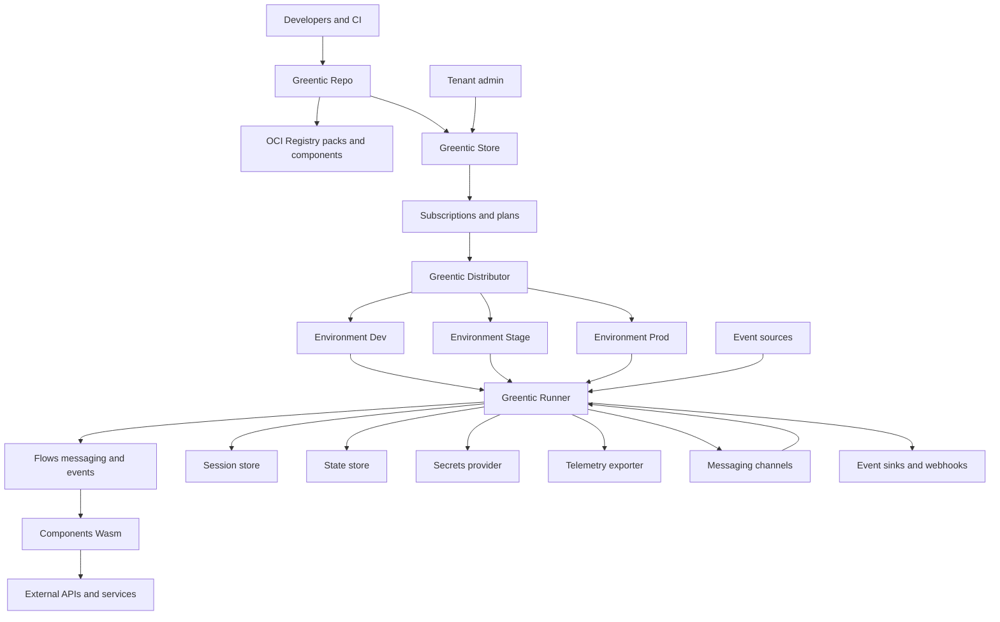

# Greentic Architecture — End-to-End Overview

## 1. Vision

Greentic is a **modular, multi-tenant automation platform** built around three major ideas:

1. Everything that runs is a **component** (Wasm).
2. Everything that orchestrates is a **flow** (messaging or events).
3. Everything that ships is a **pack** (flows + components + metadata) delivered through an enterprise supply chain.

Greentic allows teams to automate messaging, events, workflows, data processing, and digital-worker interactions without wiring infrastructure manually. Flows, components, state, and routing are fully portable through WebAssembly (Wasm) and Web Interface Types (WIT), enabling the same automation to run on desktops, cloud, Kubernetes, or disconnected enterprise environments.

The introduction of **Repo**, **Store**, and **Distributor** completes the lifecycle from:

> developer → repository → storefront → tenant subscription → environment rollout → runtime execution

---

## 2. Core Concepts

- **Pack**  
  A signed, versioned bundle containing component manifests and embedded flows (PackManifest) plus schemas/templates/metadata, capabilities, and supply-chain attestations. Packs are published to OCI registries or Greentic-Repo instances.

- **Flow**  
  A declarative YAML graph (`.ygtc`) compiled into the unified Flow model (FlowKind: messaging, event, component_config, job, http). A flow includes component refs, input/output mappings, structured routing (Routing enum), telemetry hints, and uses insertion order for ingress.

- **Component**  
  A Wasm module implementing logic described by a manifest. Components are self-describing (metadata, WIT imports, capabilities) and are independently versioned and fetched from OCI or Repo.

- **Connector**  
  A component that integrates Greentic with external systems such as Teams, Telegram, Slack, GitHub webhooks, Stripe events, OneDrive uploads, Cloudflare webhooks, etc. Connectors use the same Wasm component model.

- **Event**  
  A first-class input to the platform, separate from messaging. Events can come from webhook providers, timers, file systems, pub/sub, or cloud providers. Event flows behave like messaging flows but are not tied to a conversation.

- **Tenant / Team / User**  
  Multi-tenant identity model. Access to packs, flows, components, and secrets is controlled by a shared `TenantCtx` passed into every call.

- **Session**  
  For messaging flows, a session maintains conversational state, cursor position, pending questions, and reply context. Sessions are optional for event flows.

- **State**  
  A shared key/value memory space per session or per flow execution. Allows components to exchange data, maintain working memory, and drive routing decisions.

- **Repo**  
  The enterprise supply-chain system where components, flows, and packs are built, scanned, signed, attested, versioned, approved, and published.

- **Store**  
  The storefront where tenants discover, subscribe to, and obtain packs. Different skins (Cisco, Nutanix, Zain, Telecom Egypt, etc.) present the same underlying catalog.

- **Distributor**  
  The deployment engine that takes what a tenant subscribed to from a Store and ensures the correct packs and components are rolled out to the tenant’s environments (cloud, desktop, Kubernetes, offline), with versioning, rollback, and zero-downtime updates.

- **Runner**  
  The execution engine that loads packs, resolves components, runs flows, manages state, sessions, routing, telemetry, and secrets.

---

## 3. Big Picture Diagram

The following Mermaid diagram shows how **Repo**, **Store**, **Distributor**, **Runner**, **flows**, **components**, **messaging**, **events**, and **external systems** hang together.

---

## 4. Repositories and Their Roles

### Foundational

- **greentic-types**  
  Shared domain models: tenant, team, user, flows, component references, session, state, policies, Repo/Store/Distributor IDs, subscription models, environment models.

- **greentic-interfaces**  
  WIT packages for messaging, events, components, secrets, telemetry, repo, signing, attestation, OCI, and more. Provides host/guest bindings for Wasm.

### Supply Chain

- **greentic-repo**  
  Enterprise build/scanning/signing/attestation/publishing pipeline. Handles versioning, SBOM, policy, provenance, approvals.

- **greentic-store**  
  Multi-tenant storefront system. Provides product catalog, packs, plans, pricing, skins, and subscription management.

- **greentic-distributor**  
  Handles environment rollout, updates, zero-downtime deployment, rollback, offline sync, and distribution caching.

### Runtime Core

- **greentic-runner**  
  Loads packs, executes flows, handles routing and messaging/events, manages state and sessions, integrates secrets and telemetry, runs Wasm components.

- **greentic-session**  
  Manages sessions for messaging flows.

- **greentic-state**  
  Manages working state for flows.

- **greentic-telemetry**  
  Logging, tracing, metrics via OpenTelemetry.

- **greentic-secrets**  
  Secure secrets provider framework with multi-backend providers.

- **greentic-oauth**  
  OAuth broker as a componentized service.

### Components and Packs

- **greentic-component**  
  Component fetcher/loader with caching, OCI support, metadata validation.

- **greentic-pack**  
  Pack builder for assembling flows, manifests, components, schemas, and supply-chain metadata; signs and publishes.

- **greentic-mcp**  
  MCP component execution host for tools.

### Connectors / Entry Points

- **greentic-messaging**  
  Messaging providers via components.

- **greentic-events**  
  Event providers via packs and components. Configurable at startup.

- Future families: **greentic-webhook**, **greentic-cloud**, **greentic-slack**, **greentic-github**, **greentic-stripe**, etc.

### Developer Tools

- **greentic-conformance**  
  Standardized integration tests for packs, components, runners, connectors, Repo, Store, Distributor.

- **greentic-dev**, **greentic-demo**, **greentic-integration**  
  Developer tooling and examples.

---

## 5. Flow Execution Model

1. A messaging or event trigger is received by a connector (e.g. Teams message, webhook event, timer, file upload).  
2. For messaging, a session is created or resumed in the SessionStore. For events, execution can be stateless or use StateStore directly.  
3. The Runner selects the appropriate flow based on channel, event type, tenant, and routing configuration.  
4. The flow invokes components in sequence or via branching, passing payload and state.  
5. Components call out to external systems, update state, and emit outputs.  
6. Routing rules determine the next component or whether the flow ends.  
7. Outputs are sent back through connectors (messages, webhooks, events).  
8. Telemetry is recorded and any state/session changes are persisted.

---

## 6. Routing and State

- **SessionStore**  
  Used for messaging flows only. Stores cursor, routing position, pending output, and reply context.

- **StateStore**  
  Used by both messaging and event flows. Stores working data, answers, tool outputs, and intermediate payloads.

- **TenantCtx**  
  Propagates tenant/team/user identity through all Wasm component calls. Always passed implicitly by Runner.

- **Routing**  
  Controlled declaratively inside flows rather than components. Routing rules in flows determine next steps, branching, conditions, and termination.

---

## 7. Security Model

- **Supply-chain security** via Greentic-Repo: SBOM, scanning, signing, attestations, SLSA-style provenance.  
- **Runtime security** via tenant isolation, secret allow-lists, and outbound/network policies.  
- **Pack security** via signature verification, manifest validation, and policy enforcement at load time.

Telemetry is designed to be PII-safe with structured fields for tenant, environment, sessions, and components.

---

## 8. Observability

- OpenTelemetry spans include tenant, environment, flow, component, session, and event correlation IDs.  
- Disconnected mode supported: span batches can be stored locally until connectivity is restored.  
- Conformance suites ensure instrumentation is consistent across components and flows.

---

## 9. Deployment Targets

- **Desktop Dev** – Full local runner with embedded stores for quick iteration.  
- **Air-Gapped Enterprise** – Distributor syncs from Store snapshots into a local OCI mirror; runners use only local registries.  
- **Serverless** – Stateless runner plus Redis/KV and cloud-native connectors.  
- **Kubernetes** – Runner pods with component cache and sidecars (Redis, Elastic, Vault, etc.).  
- **Edge Devices** – Minimal runner using Wasmtime and lightweight packs.

---

## 10. Example End-to-End Lifecycle

1. Developer writes a component and a flow.  
2. Greentic-Repo builds, scans, signs, and publishes the pack to OCI.  
3. Greentic-Store exposes the pack as a product; a tenant subscribes to it.  
4. Greentic-Distributor calculates desired state and deploys the pack to the tenant’s environments.  
5. The environment’s Greentic-Runner loads the pack and components.  
6. Messaging or event triggers cause the flow to execute.  
7. Components run with access to secrets, telemetry, state, and routing.  
8. Runner sends outputs through messaging or event connectors and records telemetry.

---

## 11. Feature Summary

- Unified component model with Wasm and WIT  
- Messaging and events as first-class flow types  
- Repo for supply-chain governance  
- Store for catalog and subscription  
- Distributor for multi-environment rollout  
- Multi-tenant runtime with `TenantCtx`  
- Session and state orchestration  
- LLM-friendly flows (QA, fallbacks, structured prompts)  
- Multi-provider secrets and telemetry  
- Pack signing and OCI publishing  
- Disconnected/offline support  
- Conformance testing and validation  
- End-to-end identity, versioning, and routing

---

## 12. Future Extensions

- Workflow-level policy engine (e.g. OPA integration)  
- Full enterprise event mesh (Kafka, EventGrid, AWS EventBridge, etc.)  
- DID/VC-based trust model between Repo, Store, Distributor, and tenants  
- Self-repairing flows and component health checks  
- Code-generation agents that maintain repos based on Repo events  
- Multi-pack dependency resolution and conflict management  
- Auto-sharding runners in large enterprises  
- AI-assisted flow designer built on top of flows themselves
