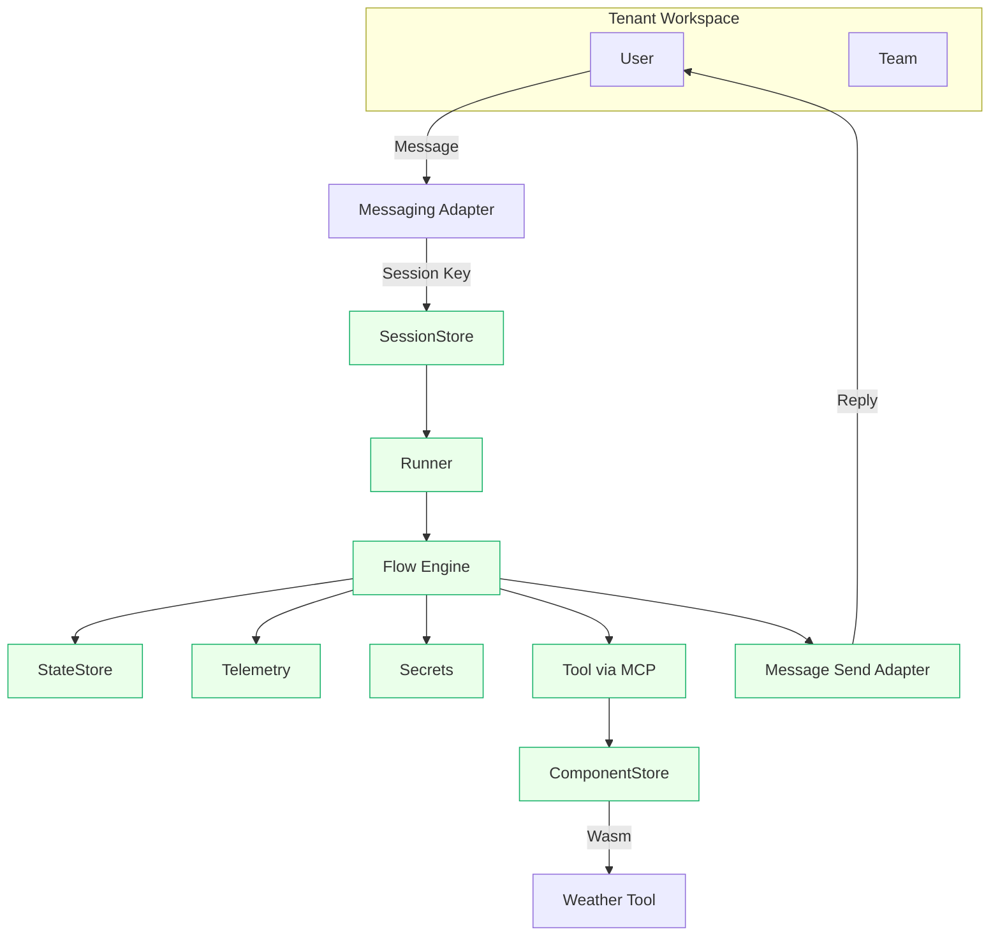

# Greentic Next-Generation Architecture — End-to-End Overview

## 1. Vision
Greentic is a **modular, multi-tenant automation and digital-worker framework** built around **packs**, **flows**, **connectors**, and **tools** that can run securely on desktop, cloud, or Kubernetes.

Its purpose is to let teams describe *what to automate* (flows, prompts, tools) instead of *how* to wire services, while staying secure and portable through Wasm (WebAssembly) and WIT (Web Interface Types).

After all Codex prompts land, Greentic becomes a cohesive ecosystem of interoperable crates and components.

---

## 2. Core Concepts

| Concept | Purpose |
|----------|----------|
| **Pack** | Deployable unit containing flows, templates, schemas, and manifests — signed and versioned. |
| **Flow** | Declarative YAML describing logic between nodes (QA, tool, template, message…). |
| **Node** | Execution unit within a flow. Each node has `kind` (e.g., `tool.invoke`, `qa`, `template.render`). |
| **Adapter / Connector** | Bridges between Greentic and the outside world (e.g., messaging.telegram, webhook.github). |
| **Tool** | Executable logic compiled to Wasm (MCP component or HTTP). |
| **Tenant / Team / User** | Multi-tenant separation model. Every operation is scoped by `TenantCtx`. |
| **Session** | Conversation / execution context that remembers where a flow is paused and resumes correctly. |
| **State** | Working memory shared between nodes or flows. |
| **Deployer** | CLI that bootstraps tenants, secrets, connectors, and deploys packs to desktops, clouds, or clusters. |

---

## 3. The Big Picture

```text
          +----------------------------+
          |      greentic-deployer     |
          |  (bootstrap & publishing)  |
          +-------------+--------------+
                        |
                        v
          +----------------------------+
          |       greentic-runner      | <===> Component Store / MCP tools
          |  loads & runs signed packs |
          +-------------+--------------+
                        |
          +----------------------------------------------+
          | Flow Engine / State Machine (in-memory)       |
          | - Executes nodes, manages sessions & state    |
          | - Talks to adapters (messaging, webhook, etc.)|
          +----------------------------------------------+
                 |                 |                |
                 v                 v                v
     greentic-session      greentic-state     greentic-telemetry
      (routing/cursor)      (data store)      (logging/tracing)
```

Everything rests on **greentic-types** (shared domain structs) and **greentic-interfaces** (WIT contracts) so all crates, packs, and Wasm tools share a common language.

---

## 4. Repositories and Their Roles

### ⚙️ Foundational Libraries
- **greentic-types** — Core Rust types: TenantCtx, SessionKey, StateKey, Outcome, Policy, etc.
- **greentic-interfaces** — WIT contracts for host/pack imports & exports, provider manifests, and component ABI.

### 💾 Runtime Core
- **greentic-session** — Session manager mapping events to sessions; in-memory & Redis backends.
- **greentic-state** — Lightweight key/value store for flow data; in-memory & Redis.
- **greentic-runner** — Orchestrator that loads packs, runs flows, manages telemetry & secrets.

### 📦 Component System
- **greentic-pack** — `packc` CLI for building, signing, and publishing packs.
- **greentic-component** — Fetches Wasm components from FS/OCI with caching.
- **greentic-mcp** — Executes WASIX MCP tools from tool maps.

### 🔐 Platform Services
- **greentic-secrets** — Multi-provider secrets with allow-lists and self-describing secrets.
- **greentic-telemetry** — OpenTelemetry logging, OTLP export, Elastic/Kibana dev stack.
- **greentic-oauth** — OAuth broker for Google, Microsoft; tokens via greentic-secrets.

### 💬 Connectors / Entry Points
- **greentic-messaging** — Messaging connectors (Telegram reference).
- **greentic-flow** — Flow schema, IR loader, and linter for adapter resolvability.

### 🧪 Developer Tools
- **greentic-conformance** — Shared test suites for packs, runner, and providers.
- **greentic-examples** — Example packs (weather demo, QA flow, etc.).
- **greentic-deployer** — Bootstrap CLI for desktop, cloud, and K8s deployment.

---

## 5. How Execution Works

### Step 1 — Bootstrap (Deployer)
`greentic-deployer bootstrap`:
1. Creates tenant/team/user.
2. Registers connectors.
3. Configures secrets.
4. Sets webhooks or polling.
5. Builds & signs packs.
6. Publishes packs & tools to OCI.

### Step 2 — Runner Loads Pack
```
greentic-runner load --pack oci://ghcr.io/greentic-ai/weather-demo:0.1.0
```
- Verifies signature.
- Registers imports: `secrets.get`, `telemetry.emit`, `tool.invoke`.

### Step 3 — Adapter Receives Event
Telegram webhook → runner → derive session key → load session → resume flow.

### Step 4 — Flow Engine Runs
- Executes QA, tool, template, message nodes.
- Updates telemetry and applies policy.

### Step 5 — Tools Execute
- Runner resolves `toolmap.json` entry, loads MCP component, executes in Wasm sandbox.

### Step 6 — Response & State Persistence
- Template renders forecast.
- Message send node posts reply.
- Runner persists state/outbox, telemetry records.

---

## 6. Session + State Interaction

| Layer | What it stores | Persistence | Used by |
|-------|----------------|-------------|---------|
| **SessionStore** | Cursor, wait reason, outbox | Redis or memory | Runner, QA, adapters |
| **StateStore** | Flow data (answers, tool outputs) | Redis or memory | QA, templates, tools |
| **TenantCtx** | Tenant/team/user identity | ephemeral | All imports |

---

## 7. Security Model

- Tenant isolation via prefixes.
- Signed packs (ed25519).
- Secrets allow-lists.
- Network policies for outbound.
- PII-safe telemetry.

---

## 8. Observability

- OpenTelemetry spans per node:
  `{ tenant, session_id, flow_id, node_id, provider, outcome }`
- Elastic/Kibana dashboards.
- Conformance checks for telemetry consistency.

---

## 9. Deployment Targets

| Environment | Description |
|--------------|-------------|
| **Desktop** | In-memory runner; dev mode bootstrap. |
| **Serverless** | Containerized runner; Redis/KV backend. |
| **Kubernetes** | Runner pod + Component cache + Redis/Elastic sidecars. |

---

## 10. Example E2E Flow (Weather Demo)

1. Telegram `/weather` → session created.
2. QA asks city → QA asks date.
3. (Optional) Ollama rewrites intent.
4. Weather MCP fetches forecast.
5. Template formats message.
6. Telegram sends reply once (idempotent).

---

## 11. Feature Summary

✅ Multi-tenant runtime  
✅ Session + State stores  
✅ Flow graph + state machine  
✅ Pack signing + OCI publishing  
✅ Policy enforcement  
✅ Messaging + OAuth + Secrets  
✅ Wasm-based tools via MCP  
✅ Observability via OTLP/Elastic  
✅ Developer CLI suite & conformance tests  
✅ K8s + Serverless ready

---

## 12. Future Extensions

- More connectors (Slack, GitHub, Stripe, etc.)
- Distributed stores (Turso/DynamoDB)
- Streaming/event-driven flows
- RAG/LLM agent nodes
- wa.dev / warg component discovery
- Declarative policies (OPA integration)

---

## 13. Diagram



---

## 14. Developer Quickstart

```bash
greentic-deployer init --tenant acme --connector messaging.telegram
greentic-deployer bootstrap --env dev-desktop

packc build -p greentic-examples/weather-demo/pack.yaml -o dist/weather.pack
packc sign -p dist/weather.pack --key ~/.greentic/dev-ed25519.pem

greentic-runner load --pack dist/weather.pack --allow-unsigned
greentic-runner run-flow --tenant acme --input '{"update":{"message":{"text":"/weather"}}}'
```

---

**Result:** A secure, modular, multi-tenant automation runtime that scales from desktop to enterprise.

---